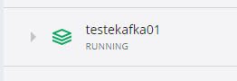

# TesteKafka01
Implementação de teste com Kafka 
Projeto criado para estudo e testes com Kafka 
  
Recursos que estarão disponiveis:  
-Envio de msg  
-Recebe Msg (Houvinte) 
-Histórico de msg's no mongo   
 
 
<h4>Requisitos</h4>
*Java11   
*MongoDB  
*Apache Kafka Instalado(Docker img)  
 
-Instalando Kafka:  
Comando: docker pull bitnami/kafka  
(https://hub.docker.com/r/bitnami/kafka/)  
  
-Acessar via cmd a pasta do projeto e rodar:   
docker-compose up -d  
 
No docker vai subir uma instancia do kafka  
  
  
[POST] Nova MSG  
 
curl --location --request POST 'http://localhost:8080/nova_mensagem' \
--header 'Content-Type: application/json' \
--data-raw '{
    "textoMensagem":"Mensagem teste msg2"
}'
 
[POST] Inicia ouvinte  
 
curl --location --request POST 'http://localhost:8080/inicia_ouvinte'
 
[GET] Lista Histórico de msg gravadas no mongo  
 
curl --location --request GET 'http://localhost:8080/historico_de_mensagens'
 